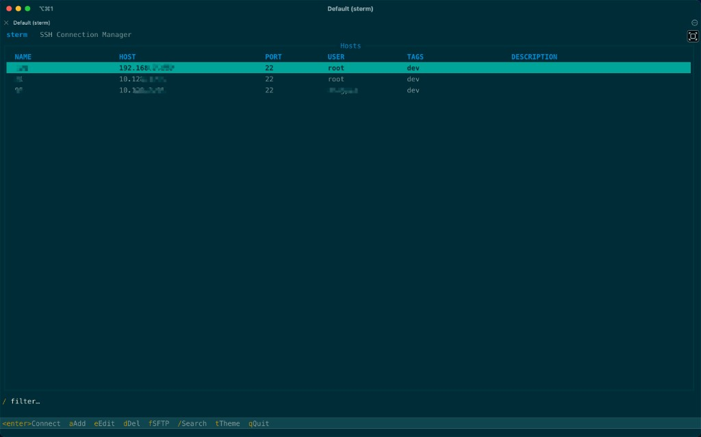
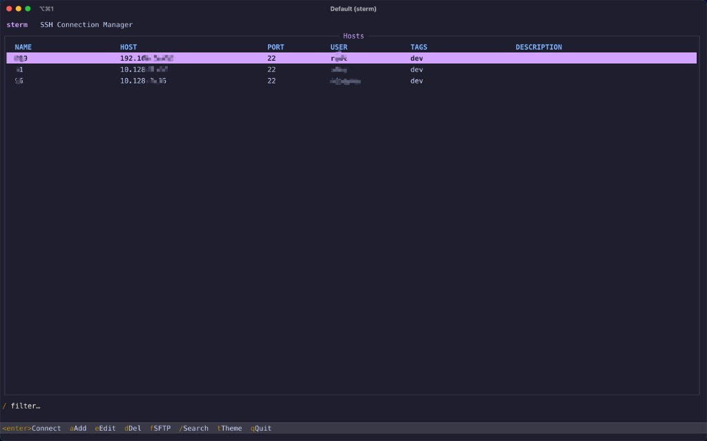
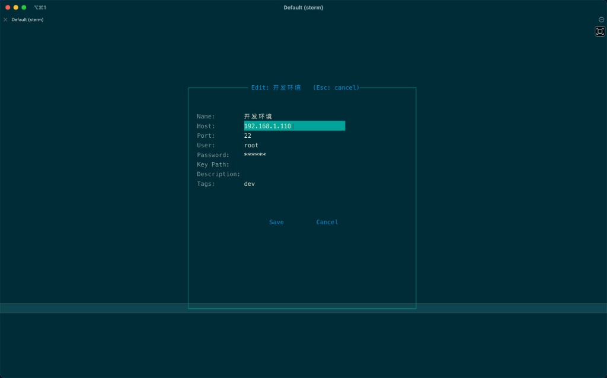
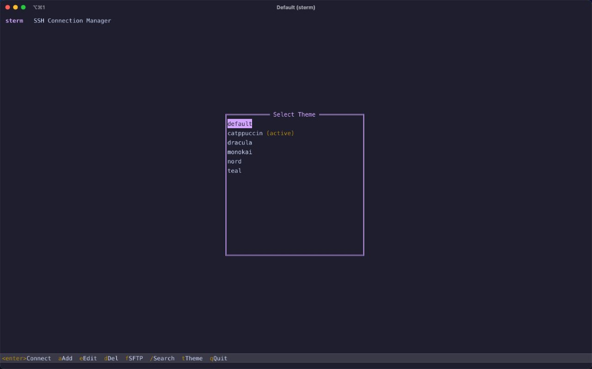
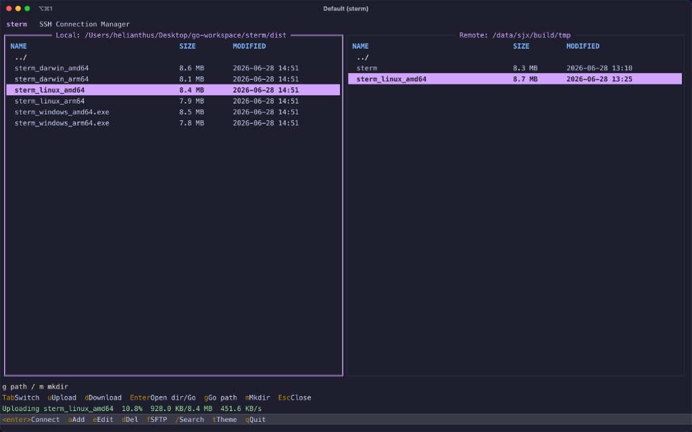

# sterm

[](LICENSE)
[](go.mod)

**English** | A terminal SSH connection manager with SFTP file transfer, encrypted password storage, and customizable themes.

**中文** | 终端 SSH 连接管理器，支持 SFTP 文件传输、密码加密存储和可定制主题。

**sterm** — **S**SH **Term**inal，一个在终端中运行的 SSH 连接与 SFTP 管理工具。

---

## Why sterm / 为什么选择 sterm

| | English | 中文 |
|---|---------|------|
| 📦 | **~8 MB** single static binary — no runtime dependencies | **约 8 MB** 单一静态二进制，无运行时依赖 |
| ⚡ | **Instant startup** — native Go TUI, no Electron or browser engine | **即开即用** — 原生 Go 终端界面，无 Electron / 浏览器内核 |
| 🪶 | **Low memory footprint** — idle RAM typically **~10–20 MB**; only active SSH/SFTP sessions consume more | **内存占用低** — 空闲时通常 **~10–20 MB**；仅在连接 SSH/SFTP 时额外占用 |
| 🔋 | **No background daemon** — runs only when you launch it, zero idle CPU | **无后台驻留** — 仅在启动时运行，空闲零 CPU |
| 🗂️ | **Plain YAML config** — human-readable, easy to back up and sync | **纯 YAML 配置** — 可读易编辑，方便备份与同步 |
| 🧩 | **All-in-one** — host management, SSH, SFTP, and themes in one tool | **功能一体** — 主机管理、SSH 连接、SFTP 传输、主题切换，一个工具搞定 |

> Built with `CGO_ENABLED=0` for a portable, self-contained executable across macOS, Linux, and Windows.
>
> 采用 `CGO_ENABLED=0` 构建，在 macOS、Linux、Windows 上均可独立运行，无需额外安装库。

---

## Positioning / 产品定位

### sterm 是什么，不是什么

**sterm 是 SSH 工作台，不是终端模拟器。**

它运行在 iTerm2、Terminal.app、Windows Terminal、Linux 终端等**已有终端**里面，负责帮你管理远程主机：维护主机列表、发起 SSH 连接、浏览和传输 SFTP 文件、加密保存密码。它不会替代 iTerm2 去提供窗口、标签页、分屏或本地 Shell 环境——那些是终端模拟器该做的事。

可以这么理解两者的关系：

```
iTerm2（终端）          →  提供窗口和本地 Shell 环境
  └─ sterm（SSH 工作台） →  管「连哪台机器、用什么账号、文件怎么传」
       └─ Enter 连接后   →  进入远程 Shell，仍在这个窗口里
```

### 和 iTerm2 等终端工具的区别

| 维度 | iTerm2 / Windows Terminal / WezTerm | sterm |
|------|---------------------------------------|-------|
| 核心职责 | 终端模拟：开窗口、标签、分屏、渲染字符 | SSH 管理：主机库、连接、SFTP、加密配置 |
| 本地 Shell | 原生支持 bash / zsh 等 | 不提供，专注远程连接 |
| 主机管理 | 需自行维护 Profile 或 `~/.ssh/config` | 内置可视化列表，支持增删改查和 `/` 搜索 |
| 文件传输 | 需另用 scp、rsync 或 FileZilla 等 | 内置双栏 SFTP 浏览器，按 `f` 即可打开 |
| 密码存储 | 通常依赖 ssh-agent、密钥或手动输入 | AES-GCM 加密写入本地 config，可备份同步 |
| 跨平台 | 各终端 UI 和配置方式不同 | 同一套 TUI 操作和 YAML 配置，macOS / Linux / Windows 一致 |

**English summary:** iTerm2 answers *"how do I interact with a terminal?"* — sterm answers *"which server do I connect to, with what credentials, and how do I transfer files?"*

### 为什么 iTerm2 用户还需要 sterm？

iTerm2 是出色的终端，但**不擅长充当 SSH 运维中枢**。当你需要频繁连接多台服务器时，往往会遇到这些痛点：

1. **主机多了就难管。** Profile 或 `~/.ssh/config` 条目一多，查找和维护成本上升。sterm 把主机集中成一张可搜索的列表，带标签和备注，在 TUI 里直接增删改。
2. **传文件要换工具。** iTerm2 本身不带 SFTP 界面，通常要另开命令行或图形客户端。sterm 按 `f` 进入双栏 SFTP，上传下载不离开终端。
3. **连接信息分散。** 哪些机器用密钥、哪些用密码、密码存在哪——iTerm2 不会帮你统一管理。sterm 把连接信息收进一份 YAML，密码加密落盘，备份一份 config 即可迁移。
4. **跨环境习惯不统一。** iTerm2 仅限 macOS；在 Linux 服务器或 Windows 上没有同一套 SSH 管理体验。sterm 是单二进制跨平台工具，你在 macOS 的 iTerm2 里用它，在远程 Linux 上也可以直接跑，操作一致。
5. **不想用重量级方案。** Termius 等工具功能全，但依赖 Electron 或云端账号。sterm 约 8 MB、无后台驻留、配置全在本地、开源可审计——适合不想把服务器密码交给第三方的人。

**sterm 不是 iTerm2 的竞品，而是跑在 iTerm2 里的 SSH 工作台。** 你继续用 iTerm2 获得最好的终端体验，用 sterm 补上「连谁、怎么连、文件怎么传」这一层。

### 谁适合用，谁不需要

**适合：**
- 经常 SSH 多台服务器的开发者或运维
- 已在用 iTerm2 / WezTerm，但 Profile 或 ssh config 维护成本高
- 需要在终端里快速完成 SFTP 传文件
- 想要轻量、本地、开源的 SSH 管理器

**不需要：**
- 只连一两台机器，直接 `ssh my-server` 就够
- 主要需求是终端分屏、tmux 集成、本地开发环境美化
- 想要独立 GUI 窗口、完全不依赖任何终端应用

---

## Features / 功能特性

| | English | 中文 |
|---|---------|------|
| 📋 | Host list with add / edit / delete | 主机增删改查 |
| 🔍 | Filter hosts by substring (`/`) | 子串过滤搜索（`/`） |
| 🔐 | Interactive SSH sessions | 交互式 SSH 连接 |
| 📁 | Dual-pane SFTP browser | 双栏 SFTP 文件浏览器 |
| 🔒 | AES-GCM encrypted passwords | 密码 AES-GCM 加密存储 |
| 🎨 | Built-in & custom themes | 内置与自定义主题 |

---

## Screenshots / 截图

### Host list / 主机列表

Solarized Dark theme / Solarized Dark 主题：



Catppuccin theme / Catppuccin 主题：



### Add / edit host / 添加与编辑主机



### Theme selector / 主题选择



### SFTP file transfer / SFTP 文件传输

Dual-pane browser with upload progress / 双栏浏览器与上传进度：



---

## Installation / 安装

### From source / 源码构建

```bash
git clone git@github.com:ha1377311454/sterm.git
cd sterm
make build
./sterm
```

### Homebrew

```bash
brew install ha1377311454/tap/sterm
```

首次安装需先 tap（一行命令已包含 tap 路径，通常无需单独执行 `brew tap`）。

升级：

```bash
brew upgrade sterm
```

### Go install / Go 安装

```bash
go install github.com/ha1377311454/sterm@latest
```

### Cross-compile / 交叉编译

```bash
make release   # outputs to dist/
```

---

## Usage / 使用方法

```bash
sterm
```

### CLI flags / 命令行参数

| Flag | Description | 说明 |
|------|-------------|------|
| `--config-dir` | Config directory | 配置目录 |
| `--key-file` | AES encryption key file | AES 加密密钥文件 |
| `--theme-dir` | Custom theme directory (repeatable) | 自定义主题目录（可多次指定） |

---

## Keybindings / 快捷键

### Host list / 主机列表

| Key | Action | 操作 |
|-----|--------|------|
| `Enter` | Connect | 连接 |
| `a` | Add host | 添加 |
| `e` | Edit host | 编辑 |
| `d` | Delete host | 删除 |
| `f` | Open SFTP | 打开 SFTP |
| `/` | Filter | 过滤搜索 |
| `t` | Change theme | 切换主题 |
| `q` | Quit | 退出 |
| `Esc` | Clear filter | 清除过滤 |

### SFTP browser / SFTP 浏览器

| Key | Action | 操作 |
|-----|--------|------|
| `Tab` | Switch pane | 切换面板 |
| `Enter` | Enter directory | 进入目录 |
| `u` | Upload | 上传 |
| `d` | Download | 下载 |
| `g` | Go to path | 跳转路径 |
| `m` | Make directory | 新建目录 |
| `Esc` | Close | 关闭 |

---

## Configuration / 配置

### Config paths / 配置路径

| OS | Path |
|----|------|
| Linux | `~/.config/sterm/` |
| macOS | `~/Library/Application Support/sterm/` |
| Windows | `%APPDATA%\sterm\` |

Files / 文件:

- `config.yaml` — host definitions / 主机定义
- `key` — AES encryption key / AES 加密密钥
- `skins/` — custom themes / 自定义主题

### Example / 示例

See [`examples/config.yaml`](examples/config.yaml).

```yaml
theme: default
connections:
  - name: my-server
    host: 192.168.1.100
    port: 22
    user: root
    password: your-password
    key_path: ~/.ssh/id_rsa
    tags: [prod]
```

Passwords are encrypted with AES-GCM before being written to disk.

密码在写入磁盘前会使用 AES-GCM 加密。

### Built-in themes / 内置主题

`default`, `solarized`, `nord`, `dracula`, `monokai`, `catppuccin`

> `teal` is kept as an alias for `solarized` in existing configs.
>
> 旧配置中的 `teal` 仍可作为 `solarized` 的别名使用。

Place custom `*.yaml` skin files in the config `skins/` directory or pass `--theme-dir`.

将自定义 `*.yaml` 主题文件放入配置目录的 `skins/` 下，或通过 `--theme-dir` 指定。

---

## Development / 开发

```bash
make test    # run tests / 运行测试
make lint    # golangci-lint (optional) / 代码检查
make tidy    # tidy modules / 整理依赖
make help    # list targets / 查看所有目标
```

---

## Security / 安全说明

- **Do not commit** `config.yaml` or `key` to version control.
- SSH **host key verification is not enabled yet**. See [SECURITY.md](SECURITY.md).

- **切勿**将 `config.yaml` 或 `key` 提交到版本库。
- SSH **主机密钥校验尚未启用**，详见 [SECURITY.md](SECURITY.md)。

---

## License / 许可证

[MIT License](LICENSE) © 2026 [ha1377311454](https://github.com/ha1377311454)
